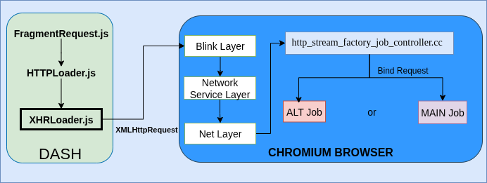
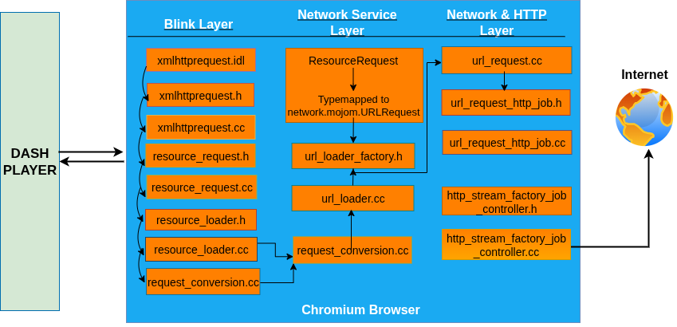

# Chromium Media Request Workflow:

When the player requests a video segment, it initiates the request through the browser, which is responsible for converting it into an actual HTTP request to the target server. Specifically, the DASH player uses XMLHttpRequest (XHR) to initiate these segment requests. XMLHttpRequest is a JavaScript API for creating an HTTP request to send a network request from the browser to the server. The above figure shows the media request workflow, which follows the steps as follows:

1. The XHR calls are first processed by the browser’s rendering engine, known as the Blink layer. Inside Blink, the request is transformed into the browser’s internal request format.
2. Once constructed, the request is passed to the renderer’s loader component, which is responsible for handling resource fetching from the network.
3. The request is then sent through the Chromium mojom system, Chromium’s interprocess communication (IPC) mechanism, which relays it from the renderer process to the browser process.
4. The browser process then constructs the final network request and selects the appropriate transport protocol: HTTP/2 over TCP, or HTTP/3 over QUIC. The browser manages two types of jobs for this purpose: the main job, which uses TCP, and the alt job, which uses QUIC.
5. The job binding is protocol-dependent: if the server supports QUIC or another alternate service, the browser binds the request to the alt job; otherwise, it falls back to the main job. The decision logic for this binding is handled by the http_stream_factory_job_controller.cc component in Chromium.

# Key Challenges in Integrating Application-Driven Protocol Selection into Chromium Browser:
1. **Per-request protocol signaling**: Chromium’s default design makes protocol choices at connection setup, using ALPN negotiation or cached Alternative Services. These mechanisms operate at the session level and not at the granularity of individual HTTP requests. Associating transport preferences with each DASH segment request, therefore, required introducing new request-level flags, while avoiding concurrency hazards if these flags were stored in global state.
2. **Deep cross-layer propagation:** HTTP requests traverse multiple layers: Blink (renderer), the network service (broker), and the net stack (transport). Adding a new field (preferredProtocol) required modifications across these layers and propagation through IPC boundaries. Further, this needs to be done all while maintaining stability and backward compatibility with existing request flows.
3. **Job orchestration complexity:** The HttpStreamFactory::JobController maintains multiple parallel jobs (main, alternate, DNS-based ALPN) and resolves them via speculative racing. The controller aggressively cancels jobs once one succeeds, which is efficient for static protocol choices but incompatible with explicit protocol directives. Preventing premature job cancellation while still leveraging Chromium’s fallback paths required restructuring the job orchestration logic.
4. **Job binding consistency:** Chromium’s assumption of a single bound job per request meant that adding explicit preferences risked leaving jobs unbound or incorrectly reused. Without careful handling, this could create orphaned connections or state inconsistencies in the event-driven machinery of the net stack.

# Modified Chromium Implementation details:

The above figure shows the modified pipeline. It operates as follows: 
1. The DASH player annotates each request with a protocol hint,
2. Blink layer transparently forwards this metadata,
3. The Network Service Layer carries the hint into the net stack, and
4. Finally, the Network and HTTP Layer (HttpStreamFactory) instantiates and binds jobs deterministically in accordance with the preference.
5. In the end, the HTTP request with the selected transport protocol is sent to the server.

The detailed description of the above-mentioned modifications and as follows:
### Step 1: DASH Player to Blink (Protocol Injection): 
The DASH player issues segment requests via the standard XMLHttpRequest API. We extended the Blink layer (rendering engine of Chromium) by adding a new protocol attribute to xmlhttprequest.idl. We modified xmlhttprequest.h and xmlhttprequest.cc to read the protocol field associated with each request. We then use this protocol field to set the **protocolMode**. In mojom, **protocolMode** is defined as an enum in the network.mojom file. It represents a transport protocol preference for a network request and gets serialized across Mojo IPC between the renderer, -> browser, -> the network service.

### Step 2: Blink to Network Service (Request Propagation): 
The network::ResourceRequest is a mojo-serializable representation of a network request. The ResourceRequest instance carries the **protocolMode** value along with other attributes of a request. It is forwarded from the browser process via Mojo to the network service. We then modified resource\_request.h and HttpRequestInfo to include   **preferredProtocol_** flag, ensuring the protocol preference persists through the out-of-process boundary into the net stack. For **protocolMode** value _khttp3_, **preferredProtocol_** flag is set to True, and for _khttp2_ and _khttp1_ it is set to False.

### Step 3: Net Stack Integration (Protocol Awareness)
In _HttpStreamFactory::JobController_, we introduced **activeProtocol** to reference **preferredProtocol_**, allowing job orchestration to access the chosen transport protocol.

### Step 4: Job Creation Logic (DoCreateJobs)
We modified the default job creation behavior to: (1) Always create both _main_job__ (HTTP/2 over TCP) and _alternative_job__ (QUIC). (2) We remove the call to ClearInappropriateJobs() to prevent premature job cancellation. We set _main_job_is_blocked__ based on **activeProtocol**: true when HTTP/3 is preferred. We explicitly initialize _alternative_job__ with kProtoQUIC. This enables deterministic job creation driven by DASH’s protocol decision.

### Step 5: Job Binding Semantics (BindJob)
We extended BindJob(Job* job) to enforce protocol consistency. We discard jobs that do not match **activeProtocol** by resetting _bound\_job\__ and _job\_bound\__. We prevent fallback to unintended protocols, ensuring fidelity to DASH’s protocol choice.

