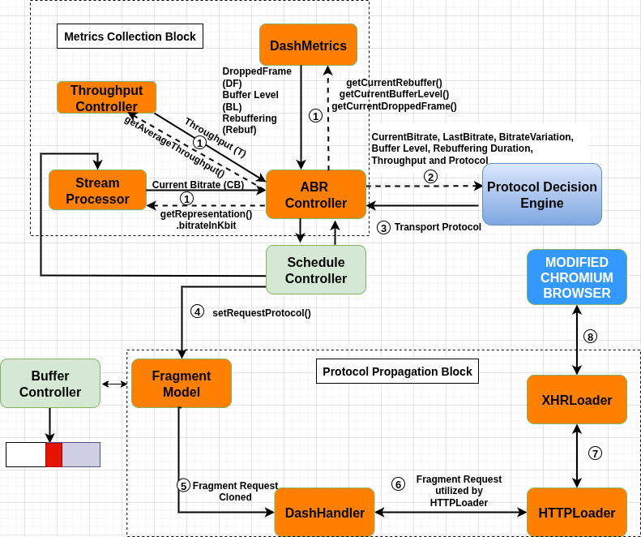

# DASH Original Media Request Workflow:

The above figure shows the **_DASH original request workflow_**:
The ScheduleController queries the ABRController to determine whether the segment quality should change. If so, ABRController selects the appropriate quality based on throughput, buffer occupancy, and related parameters, and instructs ScheduleController to schedule the new segment; otherwise, it requests the current quality. This triggers the MEDIA FRAGMENT NEEDED event, prompting StreamProcessor to generate a segment request. The request is added to the execution queue by Fragment-Model and passed to HTTPLoader, which uses XHRLoader or FetchLoader to fetch the segment from the server. Once retrieved, the segment flows back through FragmentModel to BufferController, which appends it to the media buffer for playback.

# Key Challenges in extending dash.js:
1. **Separation of functional layers:** The dash.js architecture cleanly separates metadata parsing (_FragmentRequest.js_), request orchestration (_HTTPLoader.js_), and transport execution (_XHRLoader.js_). Introducing protocol-awareness meant that decisions from the transport selection engine had to be injected consistently across all these layers without breaking modularity. Any inconsistency could cause the protocol intent to be lost before reaching Chromium.
2. **Maintaining ABR independence:** Existing Adaptive Bitrate (ABR) logic is central to dash.js and operates orthogonally to the transport layer. Integrating protocol switching without entangling it with bitrate adaptation was essential to preserve stability. A naive coupling of the two risks could destabilize adaptation decisions.
3. **Feedback-loop integration:** The decision engine relies on continuous learning from the network and QoE level feedback. However, dash.js does not natively expose fine-grained metrics in a structured manner. Capturing sufficient metrics (startup delay, rebuffer events, segment download times, etc.) while ensuring the reporting path remained lightweight required careful instrumentation.
4. **Overhead minimization:** Additional metadata propagation and metric reporting could interfere with real-time playback if implemented synchronously or with excessive logging. Ensuring that the modifications did not introduce delays or CPU pressure was a key design constraint.

# Modified DASH:

To address the above challenges we divide the modifications into two blocks:

1. **Protocol Propagation Block**: Protocol field is embedded as metadata at the point of request creation and propagated end-to-end across FragmentRequest.js, HTTPLoader.js, and XHRLoader.js. This ensures that each segment request carries explicit protocol information that Chromium can interpret deterministically.
2. **Metrics Collection Block**: QoE metrics are collected from existing monitoring hooks in dash.js (e.g., buffer events, throughput estimators) with minimal new instrumentation. These are exported asynchronously to the decision engine, preventing reporting from blocking playback or interfering with ABR logic.

The above figure shows the workflow of modified DASH as follows:
1. The ABR controller gets the QoE and network metrics from DashMetrics, Stream Processor, and Throughput Controller.
2. The DASH player invokes the decision engine prior to issuing each segment request.
3. The engine responds with the preferred protocol.
4. The preferred protocol is attached as metadata to the FragmentRequest.
5. This metadata propagates through DASHHandler, HTTPLoader, and XHRLoader, ensuring Chromium receives the correct per-request preference. This architecture enables the DASH player to act as a protocol-aware application, coordinating bitrate adaptation, per-request transport control, and QoE feedback in a modular and non-intrusive manner.

## **The Detailed implementation description of the modified workflow is as follows:**

### Step 1: For making protocol-specific requests: 
In FragmentRequest.js, we add a new field protocol to segment metadata (alongside existing fields such as media_type, quality, bandwidth, and URL). In HTTPLoader.js, which constructs HTTP requests, we incorporate the protocol field. If no protocol is set, HTTP/3 is used as the default. For audio, the protocol is always set as the alternative of the corresponding. 

### Step 2: For QoE and network metric collection:
We extend ABRController.js, specifically the function __onFragmentLoadProgress_, to invoke a new method **getNextSegmentProtocol**. This method gathers metrics including: Bitrate (from StreamProcessor.js), Buffer level, rebuffering time, and dropped frames (from DashMetrics.js), Throughput (from ThroughputController.js). These metrics are transmitted via asynchronous POST requests to the local decision engine.

### Step 3: Protocol decision integration into dash code:
The decision engine returns protocol choice (0 = HTTP/2, 1 = HTTP/3). The response updates the protocol field of the in-progress fragment request via FragmentModel.getRequest. Then, we update DashHandler.js to propagate the modified protocol field before forwarding to HTTPLoader.js. Next, the Chromium browser issues the HTTP request using the updated protocol field. This implementation ensures that protocol switching decisions are seamlessly integrated into the DASH workflow while maintaining compatibility with existing modules such as ABR and throughput estimation.
